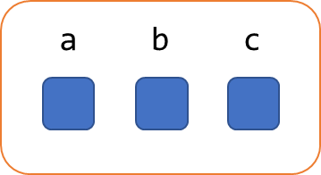
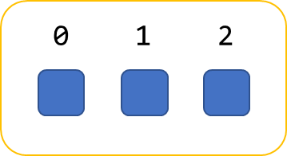
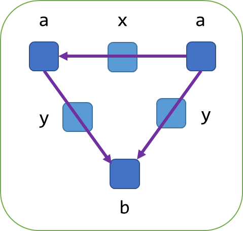

- Start Date: 2022-08-18
- PartiQL Issue: [partiql/partiql-docs/#15](https://github.com/partiql/partiql-docs/issues/15)
- RFC PR: [partiql/partiql-docs/#25](https://github.com/partiql/partiql-docs/issues/25)

# Summary
[summary]: #summary

Introduces the graph data type for the PartiQL type system defining logical representation, but not operations on the
data type.

# Motivation
[motivation]: #motivation

Graph databases such as Amazon Neptune are becoming more popular for use in applications where the traditional SQL
databases and NoSQL databases are inadequate to model data with sprawling relationships. Typically, these kinds of
applications are doing path traversals over a graph in a way that that would be awkward to express in an equivalently
modeled relational database. The question is can we and should we have a representation in the PartiQL type system that
abstracts a graph, provide graph-specific query operations, and unify this with the rest of the type system as we do
with relations and structs? Much like the goal of PartiQL is to unify nested data with relational, we should be thinking
of graph data similarly.

This proposal introduces the graph data type as a first-class type in the PartiQL type system.

Out of scope for this document is the particular syntax around graph query itself (beyond straw proposals to demonstrate
the model and how it would operate in PartiQL) or the syntax for expressing or serializing/de-serializing graph data
directly (similar to struct or bag expressions) to/from PartiQL.

# Guide-level explanation
[guide-level-explanation]: #guide-level-explanation

To introduce the PartiQL graph data type, we can first consider the other _aggregate_ data types (i.e., those containing
PartiQL values) such as bag, list, and struct. We can use the struct and list data types as helpful examples. The
struct data type is a collection of members that have an *attribute name* associated with any PartiQL value.



In the above, the PartiQL model models the attribute names and the association to the attribute’s values are a
*property* of the struct, not a property of the value contained within the struct. This is important, and also
indicative of how we extract these associations in PartiQL:

```sql
SELECT a, v FROM UNPIVOT my_struct AS v AT a
```

In this case the we use the `UNPIVOT` operator to bind the associated attribute names to their members to variables.
This query can be read informally as “find all **`a`** and **`v`** such that **`a`** and **`v`** is an attribute/value
pair in **`my_struct`**.” The list data type similarly models the association of position ordinal to member value.



Which is similarly extracted as variables:

```sql
SELECT i, v FROM my_list AS v AT i
```

For the graph data type, we model something very similar. A graph is a collection of *vertices* and *edges* that connect
them with associated direction (which may be un-directed). All vertices and edges have a *label* (similar to the
attribute name in struct) that must be a string or `NULL`. The value of a vertex or an edge can be any PartiQL value.
The following diagram illustrates the model:



In the above, we have a graph with three vertices, two labeled **`a`** and one labeled **`b`**. We have three edges, one
labeled **`x`** and two labeled **`y`**. The relationships of the edges to their respective vertices are fully contained
within the graph. All values within the graph, either an edge or vertex, can be *any* PartiQL value. This generalization
is consistent with the other container types and fits nicely in PartiQL’s data model. This also means that PartiQL
graphs *could* have vertices or edges that themselves be graphs, and likewise values can be as simple as scalar values.

As a common example, let’s consider how we could model a *labeled property graph (LPG)* to PartiQL. For LPG, each vertex
and edge are a property bag which is a struct in PartiQL.

Similarly, Resource Description Framework (RDF)[^1] graphs could be modeled in PartiQL by having non-literal, non-blank
vertices and edges labeled by URI strings with their values being NULL. RDF literals could be a NULL labeled node with
their value being any corresponding PartiQL value (this is a generalization of RDF as literals are only strings in RDF’s
model). RDF blank nodes can be denoted with a label that never conflicts with URI such as **`_:my_blank`** (**`_`** is
never a valid scheme for a URI).

Even though PartiQL generalizes the graph data model, it is *not required* that a database actually exposes arbitrary
values at vertex or edge values, this is similar to PartiQL over a relational table, where attributes of a row are
restricted to scalars.

## Data Model Integration with PartiQL Query

The SQL/PGQ specification is currently in progress, but has published elements of their work[^2]. It is important that
PartiQL aligns to an SQL standard that arises around graph query insofar as it is practically acceptable. Let us
consider a straw example of what a PartiQL graph query could look like and mean with respect to this data model.

```sql
SELECT the_a.name AS src, the_b.name AS dest
FROM my_graph MATCH (the_a:a) -[the_y:y]-> (the_b:b)
WHERE the_y.score > 10
```

In the above example, the `MATCH` sub-clause is working similar to how `UNPIVOT` works, it is effectively saying find
all **`the_a`**, **`the_y`**, and **`the_b`** such that the graph pattern matching association holds. These names are
then bound to variables that are then usable in other clauses. In other words, the loose specification of the `MATCH`
sub-clause is that it returns a bag of variable bindings much like any other `FROM` source. Similar to the way list
ordinals and struct ordinals work, the relationship matching in the graph operators are scoped to a single graph
instance and has no implications outside of that value. Such a `MATCH` clause could be as complex as needed (having
other sub-clauses) to perform the appropriate graph query constructs.

# Drawbacks
[drawbacks]: #drawbacks

*TBD*

# Rationale and Alternatives
[rationale-and-alternatives]: #rationale-and-alternatives

Some earlier discussions in graph support for PartiQL indicated that a reference type (i.e., pointer or alias) could
“solve” adding graph data for PartiQL. While this primitive could be used to construct graphs, it would not have the
same degree of abstraction as the proposed data type and it creates and issue that an associated value that is not fully
contained within a PartiQL value.

The abstraction problem can be illustrated by the LPG example, how might we solve this with references? Since scalars
themselves are atomic values, references would have to be contained in some container type such as a list or struct. Now
vertices **must** be a struct or a list, and now we’re defining a convention which is a substitution for strong typing.
Another problem in the abstraction is how do we model properties on the edges and multiple edges for a given label?
Again, we need to now model the edge property from the source as either a list/bag of references or a single reference
and we need to introduce an intermediate struct between the two vertex struct values with some convention. Assuming we
defined this convention, how would a different graph model work such as RDF? Another convention could be defined but now
we have the problem of how do we determine if the convention is being used or not (e.g., valid for a MATCH
sub-clause)—this is introducing the concept without typing the concept. If the answer is schema—that is the same as
saying we have some kind of notion of static type. References are being used here to serve as a potential implementation
detail that leaks into the logical model. A similar rationale could be used for the list data type. The relational model
could easily represent a list as a bag of structs containing an ordinal and value—but PartiQL has a first-class type
because it is often the case that we have operations directly on lists that are of value (e.g., accessing an element by
ordinal).

# Prior Art
[prior-art]: #prior-art

* Graph Pattern Matching in GQL and SQL/PGQ[^2]
* Open Cypher Query Language[^3]
* Property Graph Query Language[^4]
* GSQL [^5]

# Unresolved Questions
[unresolved-questions]: #unresolved-questions

## Data Model

As defined, a graph's label *must* be a value, should it be allowed that a graph label can be `MISSING`?

## Graph Construction

While outside the scope of this document to define such syntax, it is important to consider how graph data types might
be serialized or constructed. A database could implement a view over a relational representation of a graph with this
data type. This pattern is seen in databases such as Oracle, where a set of tables can be treated as a graph. Likewise,
PartiQL could adopt minimal syntax extensions from something like Cypher[^3] to unify its DML with graph manipulation.
Also, similar to bag, list, and struct constructor expressions, we could introduce graph constructor expressions to
create graph values (e.g., literals in expressions).

# Future Possibilities
[future-possibilities]: #future-possibilities

As this is the basis for graph operations in PartiQL, the obvious future work here is around defining the graph query
operations which should include graph pattern matching language (GPML), construction/mutation of graph data, and
comprehension/literal syntax for graphs.

[^1]: <https://www.w3.org/TR/rdf11-concepts/>
[^2]: <https://arxiv.org/pdf/2112.06217.pdf>
[^3]: <https://s3.amazonaws.com/artifacts.opencypher.org/openCypher9.pdf>
[^4]: https://pgql-lang.org/
[^5]: https://docs.tigergraph.com/gsql-ref/current/intro/intro