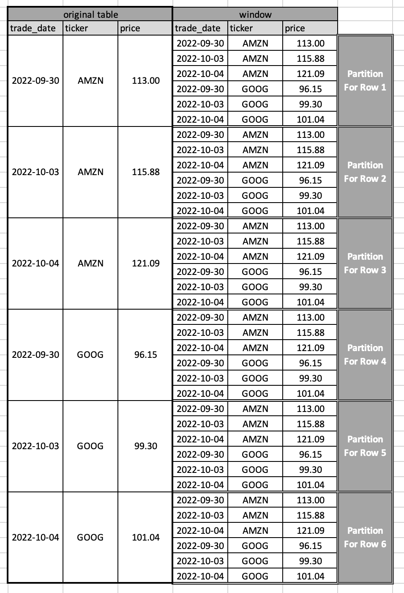
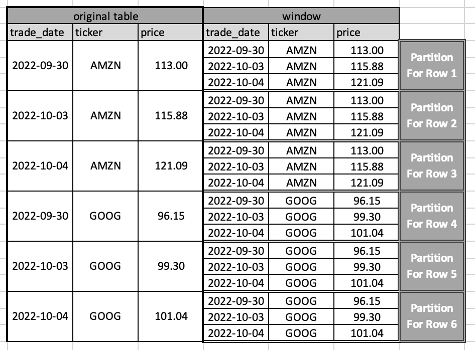
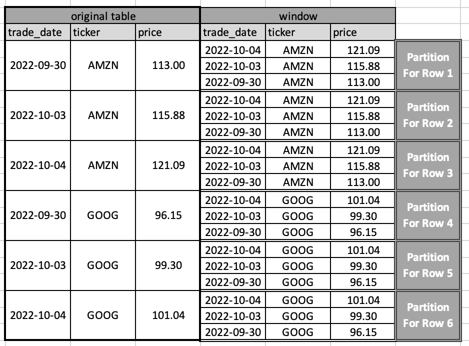

# Window Function RFC

## Summary

This RFC purposes the semantics for PartiQL core window clause and PartiQL syntactic sugar for using the SQL window function syntax.
In this RFC, we first introduce a data model to express SQL’s windowed table in nested data format, 
then we define a PartiQL Core `WINDOWED` clause that incorporates the nested data into the produced binding tuples.
Next, we demonstrate how to perform operations over the produced binding tuple.
Finally, we show that PartiQL’s window function semantic is backward compatible to SQL.

## Motivation

Window functions, also known as analytic OLAP functions, have been introduced as part of the SQL standard since 2003. Window functions allow users to express many useful queries, such as time series analysis, ranking, moving averages, etc. Formulating such queries in plain `SQL-92` can be cumbersome and inefficient, if even possible.

This RFC purposes the semantics for **window partition** in PartiQL. Subsequent RFCs are expected to cover other concepts in window function such as **peer** and **window frame**.

## Guide-level explanation

### Out of scope

* This RFC focuses on explaining the semantics of PartiQL’s window functions. The PartiQL core syntax provided in this RFC is for guidance only and specification of actual PartiQL core syntax as opposed to SQL compatible syntax is out of the scope of this RFC.
* SQL’s window implicitly defines three concepts, `PARTITION`, `FRAME`, and `PEER`. As a first step, this RFC focuses on `PARTITION` only; `FRAME` and `PEER` concepts are out of scope for now, but some preliminary work has been done to make sure the other concepts can fit into the framework in a modular fashion.
* An exhaustive mapping between SQL’s window function and PartiQL’s expression is out of the scope. In this RFC, we only define the mapping between SQL’s `lag` function and it's corresponding PartiQL expression as an example. The mapping between other functions are skipped.

We assume that the readers of this RFC has basic understanding of SQL’s window function and PartiQL semantics.

### Terminology

1. RFC key word: MUST, MUST NOT, REQUIRED, SHALL, SHALL NOT, etc. See Appendix (1) for detail. 
2. Windowed Table and Window: Windowed table is as defined in SQL spec 2011, section 4.15.14. A **windowed table** is a table together with one or more windows. A **window** is a transient data structure associated
   with a table expression. A window is defined explicitly by a window definition or implicitly by an inline window specification. Implicitly defined windows have an implementation-dependent window name. A
   **window** is used to specify window partitions and window frames, which are collections of rows used in the definition of **window functions**.
3. Partition: To distinguish between SQL's definition of window, in this RFC, the term **partition** refers to the window partition specified for each row. See [Partition As Nested Data](#Partition-As-Nested-Data) for details. 
4. Equivalent Partition: Two binding tuples $b, b' \in B^{in}_{WINDOWED}$ are in the same equivalence partition if and only if every partition expression $e_i$ evaluates to equivalent values $v_i$ (when evaluated on b) and $v_i'$ (when evaluated on $b'$). 
5. PartiQL core and PartiQL syntactic sugar: From [PartiQL Spec Section 1](https://partiql.org/assets/PartiQL-Specification.pdf#section.1): In the interest of precision and succinctness, we tier the PartiQL specification in two layers: The PartiQL core is a functional programming language with composable aspects. Three aspects of the PartiQL core syntax and semantics are characteristic of its functional orientation: Every (sub)query and every (sub) expression input and output PartiQL data. Second, each clause of a SELECT query is itself a function. Third, every (sub)query evaluates within the environment created by the database names and the variables of the enclosing queries.
   Then we layer “syntactic sugar” features over the core. Commonly, syntactic sugar achieves well-known SQL syntax and semantics. Formally, every syntactic sugar feature is explained by reduction to the core. 


### PartiQL’s Window Function Semantics

In the following section, we first define the semantics for `WINDOWED` clause in PartiQL.
The PartiQL `WINDOWED` clause can be thought of as a standalone operator that inputs a collection of binding tuples and outputs a collection of binding tuples.

Informally:
Each binding tuple outputted by the `WINDOWED` clause contains "information" regarding: 1) the current binding tuple from the input, 2) the partition for the current binding tuple, 3) the index for access the current binding tuple in partition.

This section proceed in four steps:
- Section [Partition As Nested Data](#Partition-As-Nested-Data) explains how to create a partition for each row/binding tuple, such partition created will be incorporated into the binding tuple produced by `WINDOWED` clause.
- Section [WINDOWED Clause](#WINDOWED-Clause) explains the core PartiQL WINDOWED structure and the binding tuples created by `WINDOWED` clause.
- Section [Operations on Partition](#Operations-Over-Partition) explains how to perform operation over the produced partition data.
- Section [SQL Compatibility](#SQL-Compatibility) shows that SQL's window functions can be explained over by PartiQL's `WINDOWED` clause and expressions.

#### Partition As Nested Data
In this section, we introduce a way to model partition as nested data. 
Notice that the nested data format, although not fitting in SQL's formal semantics, provides a simple and intuitive way to understand window function results, and forms the basis for PartiQL's window semantics.

In SQL, a window(and therefore the concept of partition) can be defined implicitly by an inline window specification.
We will use SQL's syntax during the analysis here to imply the creation of partitions only. The later sections will dive into other concepts of window functions.  

SQL’s in-line window function that operates without frame clause looks like:

```sql
-- FRAME clause is out of the scope
<window_function> OVER ( 
            [PARTITION BY <partition_expression>] 
            [ORDER BY <sort spec>] )
```
That is, a window function followed by a `OVER` clause.

Example 1.1.1: 

Lag Function Syntax
```sql
LAG (expression [,offset] [,default])  
   OVER ( 
            [PARTITION BY <partition_expression>] 
            ORDER BY <sort spec> )
```
More detail about lag functions can be found in the later section([Using SQL’s inline window function in PartiQL](#Using-SQL’s-inline-window-function-in-PartiQL)). This example here is for demonstration purpose only.

Notice that SQL’s `OVER` clause is more expressive, for example, it may support an additional optional `frame` sub-clause and define a peer group implicitly. In this RFC, we focus on the **partition** defined by the `OVER` clause and the following sub-clauses:

**PARTITION BY**:  Partitions the input by one or more expression and turns the input into independent groups, and thereby restricts the window of a tuple. Unlike `GROUP BY`/normal aggregation, the window function does not reduce all tuples of a group into a single tuple, but only logically partitions the tuples into group. If no `PARTITION BY` is specified, the entire table is considered as belonging to the same partition.

**ORDER BY**: Orders rows within each partition. Semantically, the order by clause defines how input tuples are logically ordered during window function evaluation. Note that if no ordering is specified, the rows inside partition have no deterministic ordering.

The following examples shows how we compute the partition for each row and store it via nested data.
Notice that **list** notion is used to store the partition data regardless of the presence of ORDER BY sub-clause.
The reason for such choice will be further explained in the next section.

Consider the input data to be:

```
<<
  {
    'trade_date' : 2022-09-30,
    'ticker' : 'AMZN', 
    'price' : 113.00
  },
  {
    'trade_date' : 2022-10-03,
    'ticker' : 'AMZN', 
    'price' : 115.88
  },
  {
    'trade_date' : 2022-10-04,
    'ticker' : 'AMZN', 
    'price' : 121.09
  },
  {
    'trade_date' : 2022-09-30,
    'ticker' : 'GOOG', 
    'price' : 96.15
  },
  {
    'trade_date' : 2022-10-03,
    'ticker' : 'GOOG', 
    'price' : 99.30
  },
  {
    'trade_date' : 2022-10-04,
    'ticker' : 'GOOG', 
    'price' : 101.04
  }         
>>
```

Example 1.1.2:

Let us consider a simple example with no `PARTITION BY` and `ORDER BY` sub-clause:

`<func> OVER () -- window specification is empty`.



The above figure shows the original table with partition for each row. Notice that
since there is no `PARTITION BY` sub-clause, the entire table are considered as within the same partition
and since there is no `ORDER BY` sub-clause, there is no deterministic order for the partition.

We can turn the final result in the above figure in nested data format:
```
<<
 -- Row 1
  {
    'trade_date' : 2022-09-30,
    'ticker' : 'AMZN', 
    'price', 113.00
    -- partition for row 1
    'partition' : 
      [
          <<
            'trade_date' : 2022-09-30,
            'ticker' : 'AMZN', 
            'price' : 113.00
          >>,
          <<
            'trade_date' : 2022-10-03,
            'ticker' : 'AMZN', 
            'price' : 115.88
          >>,
          <<
            'trade_date' : 2022-10-04,
            'ticker' : 'AMZN', 
            'price' : 121.09
          >>,
          <<
            'trade_date' : 2022-09-30,
            'ticker' : 'GOOG', 
            'price' : 96.15
          >>,
          <<
            'trade_date' : 2022-10-03,
            'ticker' : 'GOOG', 
            'price' : 99.30
          >>,
          <<
            'trade_date' : 2022-10-04,
            'ticker' : 'GOOG', 
            'price' : 101.04
          >>   
      ]
  }    
  -- rest of the data skiped
  ...  
>>
```

Example 1.1.3:

Window specification has PARTITION BY sub-clause

`<func> OVER (PARTITION BY ticker) -- has partition by sub-clause`



Since there is a `PARTITION BY` clause, the partition is limited to all rows that have the same `ticker` value.

Similarly, the result in nested data format will be:
```
<<
 -- Row 1
  {
    'trade_date' : 2022-09-30,
    'ticker' : 'AMZN', 
    'price', 113.00
    -- partition for row 1
    'partition' : 
      [
          <<
            'trade_date' : 2022-09-30,
            'ticker' : 'AMZN', 
            'price' : 113.00
          >>,
          <<
            'trade_date' : 2022-10-03,
            'ticker' : 'AMZN', 
            'price' : 115.88
          >>,
          <<
            'trade_date' : 2022-10-04,
            'ticker' : 'AMZN', 
            'price' : 121.09
          >>
      ]
  }    
  -- rest of the data skiped
  ...  
>>
```
Example 1.1.4:

Window specification has ORDER BY sub-clause

`<func> OVER (ORDER BY price) -- has ORDER BY sub-clause`


```
<<
 -- Row 1
  {
    'trade_date' : 2022-09-30,
    'ticker' : 'AMZN', 
    'price', 113.00
    -- partition for row 1
    'partition' : 
      [
          <<
            'trade_date' : 2022-09-30,
            'ticker' : 'GOOG', 
            'price' : 96.15
          >>,
          <<
            'trade_date' : 2022-10-03,
            'ticker' : 'GOOG', 
            'price' : 99.30
          >>,
          <<
            'trade_date' : 2022-10-04,
            'ticker' : 'GOOG', 
            'price' : 101.04
          >>,
          <<
            'trade_date' : 2022-09-30,
            'ticker' : 'AMZN', 
            'price' : 113.00
          >>,
          <<
            'trade_date' : 2022-10-03,
            'ticker' : 'AMZN', 
            'price' : 115.88
          >>,
          <<
            'trade_date' : 2022-10-04,
            'ticker' : 'AMZN', 
            'price' : 121.09
          >>
      ]
  }    
  -- rest of the data skiped
  ...  
>>
```

Example 1.1.5:

Window specification has both PARTITION BY AND ORDER BY sub-clause

Notice that to demonstrate the difference visually, the result will be sorted in descending order.

`<func> OVER (PARTITION BY ticker ORDER BY price DESC)  -- has PARTITION BY and ORDER BY sub-clause`



```
<<
 -- Row 1
  {
    'trade_date' : 2022-09-30,
    'ticker' : 'AMZN', 
    'price', 113.00
    -- partition for row 1
    'partition' : 
      [
          <<
            'trade_date' : 2022-10-04,
            'ticker' : 'AMZN', 
            'price' : 121.09
          >>,
          <<
            'trade_date' : 2022-10-03,
            'ticker' : 'AMZN', 
            'price' : 115.88
          >>,
          <<
            'trade_date' : 2022-09-30,
            'ticker' : 'AMZN', 
            'price' : 113.00
          >>
      ]
  }
  -- rest of the data skiped
  ...  
>>
```

#### WINDOWED Clause 

```sql
WINDOWED (
    PARTITION BY e1, e2, ..., em
    ORDER BY (o1 [ASC|DESC]? [NULLS FIRST| NULLS LAST]?,
              ...,
              on [ASC|DESC]? [NULLS FIRST| NULLS LAST]?
    ) PARTITION AS p AT pos
```

Where $e_1,...,e_n$ is a list of **partition expressions**, $o_1,....,o_n$ is a list of **ordering expressions**, $p$ is the **partition variable**, and $pos$ is the **position variable** which indicates the position of the current row in the partition.

The `WINDOWED` clause can be viewed as a modular function, with $B^{in}_{WINDOWED}$ (a bag of binding tuples) as an input parameter to the function.


1. PARTITION BY sub-clause:

* If PARTITION BY is presented: $B^{in}_{WINDOWED}$ is partitioned into the minimal number of equivalence partition $B_1,...,B_n$. The equivalence rule is the same as the one used in `GROUP BY` clause (Appendix 2). 
* If there is no `PARTITION BY`, the entire input binding collection is considered as one partition.
* Each of the $B_i$ produced by `PARTITION BY` SHALL be a list instead of a bag, even though the order is non-deterministic at the moment. The partition needs to be a list because we want to use the index to locate the original row.

2. ORDER BY sub-clause:

* If ORDER BY is presented, each equivalence partition is ordered based on the rules defined in Spec Section 12 (Appendix 3).
* Notice that the ORDER BY in WINDOWED clause applies to partition only, it does not necessarily affect the final order of the result.

3. WINDOWED clause output:

* For each binding tuple $b_i$ in $B^{in}_{WINDOWED}$, output $b = b_i || < p : B_i, pos: x>$ where $b_i$ in $B_i$ and $p[x] = b_i$.
* Notice that in case of duplication, the pos is nondeterministic but **MUST** be guaranteed to be unique.

Logically, `WINDOWED` clause is evaluated after `GROUP BY` and `HAVING` and before `ORDER BY`, the evaluation order looks like:

```
FROM -> WHERE -> GROUP BY -> HAVING -> WINDOWED -> ORDER BY -> LIMIT -> SELECT 
```

#### Examples

Suppose  $B^{in}_{WINDOWED}$ is:

```
<<
    <stock : {'trade_date': 2022-09-30, 'ticker': 'AMZN', 'price': 113.00}>,
    <stock : {'trade_date': 2022-10-03, 'ticker': 'AMZN', 'price': 115.88}>,
    <stock : {'trade_date': 2022-09-30, 'ticker': 'GOOG', 'price': 96.15}>
>>
```

Example 1.2.1: Window specification without `PARTITION BY` AND `ORDER BY`

```sql
WINDOWED () PARTITION AS p AT pos
```

The output binding collection is:

```
<<
   <
    stock : {'trade_date': 2022-09-30, 'ticker': 'AMZN', 'price': 113.00},
    p : [
          <stock : {'trade_date': 2022-09-30, 'ticker': 'AMZN', 'price': 113.00}>,
          <stock : {'trade_date': 2022-10-03, 'ticker': 'AMZN', 'price': 115.88}>,
          <stock : {'trade_date': 2022-09-30, 'ticker': 'GOOG', 'price': 96.15}>
        ],
    pos: 0
   >,
   <
    stock : {'trade_date': 2022-10-03, 'ticker': 'AMZN', 'price': 115.88},
    p : [
          <stock : {'trade_date': 2022-09-30, 'ticker': 'AMZN', 'price': 113.00}>,
          <stock : {'trade_date': 2022-10-03, 'ticker': 'AMZN', 'price': 115.88}>,
          <stock : {'trade_date': 2022-09-30, 'ticker': 'GOOG', 'price': 96.15}>
        ],
    pos: 1
   >,
   <
    stock : {'trade_date': 2022-09-30, 'ticker': 'GOOG', 'price': 96.15},
    p : [
          <stock : {'trade_date': 2022-09-30, 'ticker': 'AMZN', 'price': 113.00}>,
          <stock : {'trade_date': 2022-10-03, 'ticker': 'AMZN', 'price': 115.88}>,
          <stock : {'trade_date': 2022-09-30, 'ticker': 'GOOG', 'price': 96.15}>
        ],
    pos: 2
   > 
>>
```

Remarks: If `ORDER BY` is not present, the order of partition variable `p` is arbitrary.

Example 1.2.2: Window specification with `PARTITION BY` only

```sql
WINDOWED (PARTITION BY stock.ticker) PARTITION AS p AT pos
```

The output binding collection is:

```
<<
   <
    stock : {'trade_date': 2022-09-30, 'ticker': 'AMZN', 'price': 113.00},
    p : [
          <stock : {'trade_date': 2022-09-30, 'ticker': 'AMZN', 'price': 113.00}>,
          <stock : {'trade_date': 2022-10-03, 'ticker': 'AMZN', 'price': 115.88}>
        ],
    pos: 0
   >,
   <
    stock : {'trade_date': 2022-10-03, 'ticker': 'AMZN', 'price': 115.88},
    p : [
          <stock : {'trade_date': 2022-09-30, 'ticker': 'AMZN', 'price': 113.00}>,
          <stock : {'trade_date': 2022-10-03, 'ticker': 'AMZN', 'price': 115.88}>
        ],
    pos: 1
   >,
   <
    stock : {'trade_date': 2022-09-30, 'ticker': 'GOOG', 'price': 96.15},
    p : [
          <stock : {'trade_date': 2022-09-30, 'ticker': 'GOOG', 'price': 96.15}>
        ],
    pos: 0
   > 
>>
```

Remark: Notice that the partition produced is a list, but the order of the elements in the produced partition list is arbitrary.

Example 1.2.3: Window specification with `ORDER BY` only

```sql
WINDOWED (ORDER BY stock.price) PARTITION AS p AT pos
```

The output binding collection is:

```
<<
   <
    stock : {'trade_date': 2022-09-30, 'ticker': 'AMZN', 'price': 113.00},
    p : [
          <stock : {'trade_date': 2022-09-30, 'ticker': 'GOOG', 'price': 96.15}>,
          <stock : {'trade_date': 2022-09-30, 'ticker': 'AMZN', 'price': 113.00}>,
          <stock : {'trade_date': 2022-10-03, 'ticker': 'AMZN', 'price': 115.88}>
        ],
    pos: 1
   >,
   <
    stock : {'trade_date': 2022-10-03, 'ticker': 'AMZN', 'price': 115.88},
    p : [
          <stock : {'trade_date': 2022-09-30, 'ticker': 'GOOG', 'price': 96.15}>,
          <stock : {'trade_date': 2022-09-30, 'ticker': 'AMZN', 'price': 113.00}>,
          <stock : {'trade_date': 2022-10-03, 'ticker': 'AMZN', 'price': 115.88}>
        ],
    pos: 2
   >,
   <
    stock : {'trade_date': 2022-09-30, 'ticker': 'GOOG', 'price': 96.15},
    p : [
          <stock : {'trade_date': 2022-09-30, 'ticker': 'GOOG', 'price': 96.15}>,
          <stock : {'trade_date': 2022-09-30, 'ticker': 'AMZN', 'price': 113.00}>,
          <stock : {'trade_date': 2022-10-03, 'ticker': 'AMZN', 'price': 115.88}>
        ],
    pos: 0
   > 
>>
```

Remark: Notice that the partition produced is a list, and the order of the elements in the produced partition list are deterministic, yet the output binding tuple $B^{OUT}_{WINDOWED}$ is still a bag. This is because the `ORDER BY` sub-clause within the window specification does not necessarily affect the output binding tuple ordering.

Example 1.2.4: Window specification with `PARTITION BY` and `ORDER BY` sub-clause:

```sql
WINDOWED (PARTITION BY stock.ticker ORDER BY stock.price DESC) 
    PARTITION AS p AT pos
```

The output binding collection is:

```
<<
   <
    stock : {'trade_date': 2022-09-30, 'ticker': 'AMZN', 'price': 113.00},
    p : [
          <stock : {'trade_date': 2022-10-03, 'ticker': 'AMZN', 'price': 115.88}>,
          <stock : {'trade_date': 2022-09-30, 'ticker': 'AMZN', 'price': 113.00}>
        ],
    pos: 1
   >,
   <
    stock : {'trade_date': 2022-10-03, 'ticker': 'AMZN', 'price': 115.88},
    p : [
          <stock : {'trade_date': 2022-10-03, 'ticker': 'AMZN', 'price': 115.88}>,
          <stock : {'trade_date': 2022-09-30, 'ticker': 'AMZN', 'price': 113.00}>
        ],
    pos: 0
   >,
   <
    stock : {'trade_date': 2022-09-30, 'ticker': 'GOOG', 'price': 96.15},
    p : [
          <stock : {'trade_date': 2022-09-30, 'ticker': 'GOOG', 'price': 96.15}>
        ],
    pos: 0
   > 
>>
```

Example 1.2.5: Interaction with GROUP BY:

```
GROUP BY EXTRACT(MONTH FROM trade_date) as month, ticker GROUP AS g
WINDOWED (PARTITION BY stock.ticker ORDER BY month) PARTITION AS p AT pos
```

First, consider the output binding collection from GROUP BY: 

```
<<
  <
    'month': 9, 'ticker': 'AMZN',
    'g': <<
      <
        'stock': { 'trade_date': `2022-09-30`, 'ticker': 'AMZN', 'price': 113.00 }
      >
    >>
  >,
  <
    'month': 9, 'ticker': 'GOOG',
    'g': <<
      <
        'stock': { 'trade_date': `2022-09-30`, 'ticker': 'GOOG', 'price': 96.15}
      >
    >>
  >,
  <
    'month': 10, 'ticker': 'AMZN',
    'g': <<
      <
        'stock': { 'trade_date': `2022-10-03`, 'ticker': 'AMZN', 'price': 115.88 }
      >
    >>
  >
>>
```

Next, consider the output binding collection FROM WINDOWED clause: 
```
<<
  <
    'month': 9, 'ticker': 'AMZN',
    'g': <<
      <
        'stock': { 'trade_date': `2022-09-30`, 'ticker': 'AMZN', 'price': 113.00 }
      >
    >>
    p : [
          < 
            'month': 9, 'ticker': 'AMZN',
            'g': << 
              <
                'stock': { 'trade_date': `2022-09-30`, 'ticker': 'AMZN', 'price': 113.00 }
              >
            >>
          >, 
          < 'month': 10, 'ticker': 'AMZN',
             'g': <<
               <
                 'stock': { 'trade_date': `2022-10-03`, 'ticker': 'AMZN', 'price': 115.88 }
               >
             >>
          >
        ],
    pos: 0
  >,
  <
    'month': 9, 'ticker': 'GOOG',
    'g': <<
              <
                'stock': { 'trade_date': `2022-09-30`, 'ticker': 'GOOG', 'price': 96.15 }
              >
         >>
    p : [ 
          <
            'month': 9, 'ticker': 'GOOG',
            'g': <<
                   <
                    'stock': { 'trade_date': `2022-09-30`, 'ticker': 'GOOG', 'price': 96.15 }
                   >
                  >>
          >        
        ],
    pos : 0    
  >,
  <
    'month': 10, 'ticker': 'AMZN',
    'g': <<
      <
        'stock': { 'trade_date': `2022-10-03`, 'ticker': 'AMZN', 'price': 115.88 }
      >
    >>
    p : [
          < 'month': 9, 'ticker': 'AMZN',
            'g': << 
              <
                'stock': { 'trade_date': `2022-09-30`, 'ticker': 'AMZN', 'price': 113.00 }
              >
            >>
          >, 
          < 'month': 10, 'ticker': 'AMZN',
             'g': <<
               <
                 'stock': { 'trade_date': `2022-10-03`, 'ticker': 'AMZN', 'price': 115.88 }
               >
             >>
          >
        ],
    pos: 1
  >
>>
```


Example 1.2.6: Data set with NULL and MISSING: 

Recall that the equivalence function will treat the **NULL** and the **MISSING** expression as the same: 

Suppose  $B^{in}_{WINDOWED}$ is:

```
<<
    <stock : {'trade_date': 2022-09-30, 'ticker': 'AMZN', 'price': 113.00}>,
    <stock : {'trade_date': 2022-10-03, 'ticker': 'AMZN', 'price': 115.88}>,
    <stock : {'trade_date': 2022-09-30, 'ticker': 'NULL', 'price': 96.15}>
    <stock : {'trade_date': 2022-10-03, 'price': 100.00}>
    <stock : {'price': 200.00}>
>>
```

```sql
WINDOWED (PARTITION BY stock.ticker) PARTITION AS p AT pos
```

The output binding collection is:

```
<<
   <
    stock : {'trade_date': 2022-09-30, 'ticker': 'AMZN', 'price': 113.00},
    p : [
          <stock : {'trade_date': 2022-10-03, 'ticker': 'AMZN', 'price': 115.88}>,
          <stock : {'trade_date': 2022-09-30, 'ticker': 'AMZN', 'price': 113.00}>
        ],
    pos: 1
   >,
   <
    stock : {'trade_date': 2022-10-03, 'ticker': 'AMZN', 'price': 115.88},
    p : [
          <stock : {'trade_date': 2022-10-03, 'ticker': 'AMZN', 'price': 115.88}>,
          <stock : {'trade_date': 2022-09-30, 'ticker': 'AMZN', 'price': 113.00}>
        ],
    pos: 0
   >,
   <
    stock : {'trade_date': 2022-09-30, 'ticker': NULL, 'price': 96.15},
    p : [
          <stock : {'trade_date': 2022-09-30, 'ticker': 'NULL', 'price': 96.15}>,
          <stock : {'trade_date': 2022-10-03, 'price': 100.00}>,
          <stock : {'price': 200.00}>
        ],
    pos: 0
   >,
   <
    stock : {'trade_date': 2022-10-03, 'price': 100.00},
    p : [
          <stock : {'trade_date': 2022-09-30, 'ticker': 'NULL', 'price': 96.15}>,
          <stock : {'trade_date': 2022-10-03, 'price': 100.00}>,
          <stock : {'price': 200.00}>
        ],
    pos: 1
   >,
   <
    stock : {'price': 200.00},
    p : [
          <stock : {'trade_date': 2022-09-30, 'ticker': 'NULL', 'price': 96.15}>,
          <stock : {'trade_date': 2022-10-03, 'price': 100.00}>,
          <stock : {'price': 200.00}>
        ],
    pos: 2
   > 
>>
```


#### Operations Over Partition

The `WINDOWED` clause computes the partition for each row and carry the partition in the input binding tuples. 

Like other clauses, the output of binding tuples from `WINDOWED` clauses becomes the input of next operator. 

The scoping rules and path navigation behave as normal. 

Example 1.3.1: 

Consider if we would like to retrieve the current price and the previous price of a given stock, and if there is no previous data, we want to return null.
```sql
SELECT VALUE
    {'ticker' : stock.ticker,
     'current_price': stock.price,
     'previous_price' : CASE WHEN pos - 1 >= 0 THEN CAST ( SELECT VALUE stock.price FROM p AT idx WHERE idx = pos - 1 AS LIST)[0]
                             ELSE NULL END
    }
FROM stock AS stock
WINDOWED (
        PARTITION BY stock.ticker
        ORDER BY stock.trade_date
    ) PARTITION AS p AT pos
```

Note that the casting to list is necessary because SELECT VALUE wraps the result in a bag. 

#### SQL Compatibility

For SQL compatibility, PartiQL allows use of SQL syntax directly.

SQL allows three ways to specify window:
1) inline window specification:

Example 1.4.1: 
```sql
SELECT 
    rank() OVER (PARTITION BY ticker), -- inline window specification
    lag(price) OVER (PARTITION BY ticker ORDER BY date)
FROM stock as s
```

2) window clause

Example 1.4.2:
```sql
SELECT 
    rank() OVER w1,
    lag(price) OVER w2
FROM stock as s
WINDOW w1 AS (PARTITION BY ticker) -- window clause
       w2 AS (PARTITION BY ticker ORDER BY date) -- window clause
```

3) reuse window definition

Example 1.4.3:
```sql
SELECT
    rank() OVER w1,
    lag(price) OVER w2
FROM stock as s
WINDOW w1 AS (PARTITION BY ticker)
       w2 AS (w1 ORDER BY date) -- reuse window definition
```
The above three queries are functionally the same.

We can rewrite a query in SQL’s window function syntax to PartiQL syntax.

Suppose that a query:
1. Is a SELECT query
2. the SELECT clause contains one or more SQL window function (identified by OVER)

Then the query is rewritten using the following process:

* If the query contains variants of SQL's WINDOW clause, rewrite the query in form of inline window specification by replacing the window alias with the specification associated with it.
* Denote each window function as $wf_i$, its window specification $ws_i$
* Add a WINDOWED keyword(if not already exist)
* For each window function $wf_i$:
* Add the inline window specification $ws_i$
* Add PARTITION AS $ws\\_i\\_partition$ AT $ws\\_i\\_pos$
* Rewrite $wf_i$ into $wf'_i$ where $wf'_i$ is a PartiQL expression. Note $wf_i$ does not necessary need to be a function

For each SQL window function $wf$, an implementation MAY offer a corresponding core PartiQL expression $wf'$. For example, the mapping relationship for SQL’s `LAG` function is

Example 1.4.4: An example mapping for LAG function

```sql
 LAG(${expr}, ${offset}, ${default}) OVER (...) 
    -> CASE WHEN ws_i_pos - ${offset} >= 0 THEN 
                CAST (SELECT VALUE ${expr} FROM ws_i_partition AT idx WHERE idx = ws_i_pos - ${offset} AS LIST)[0]
            ELSE ${default} END
       -- rest of clauses i.e, FROM, WINDOWED, etc are skipped.      
```


The PartiQL expression $wf'_i$ and the core PartiQL `WINDOWED` Clause, together explains the semantics of SQL's window function. Nevertheless, it is possible that an implementation offer only the SQL style window function without implementing the `WINDOWED` clause and defining a mapping relationship.

The rewriting approach provided by this RFC creates a one-to-one mapping between a window function and the window specification. E.g. if there are two window functions in a query there will be two corresponding representation of the function in logical plan as WINDOWED clauses. An implementation MAY choose to optimize the physical execution by concatenating the resulting `WINDOWED` clauses.

Example 1.4.5: One-to-one mapping between window function and window specification

```sql
SELECT 
    rank() OVER (PARTITION BY s.ticker ORDER BY s.trade_date) as rank,
    lag(price) OVER (PARTITION BY s.ticker ORDER BY s.trade_date) as prev_price
FROM stock as s

```

Will be rewritten to:

```sql
SELECT VALUE
    'rank' : coll_rank(ws_1_partition, ws_1_pos), -- the mapping from SQL to PartiQL is not finalized. 
    'prev_price': CASE WHEN ws_i_pos - 1 >= 0 THEN
                    CAST (SELECT VALUE s.price FROM ws_2_partition AT idx WHERE idx = ws_2_pos - 1 AS LIST)[0]
                  ELSE NULL END
FROM stock as s
WINDOWED
    (PARTITION BY l.ticker ORDER BY l.trade_time) 
        PARTITION AS ws_1_partition AT ws_1_pos
    (PARTITION BY l.ticker ORDER BY l.trade_time)
        PARTITION AS ws_2_partition AT ws_2_pos
```

### Using SQL’s inline window function in PartiQL

For completeness, we show how to use SQL’s `LAG` and `LEAD` window function in PartiQL.

Supported grammar:

```
<window function> ::= <window function type> OVER <window specification> 
<window function type> ::= <lead or lag function>
<lead or lag function> ::= <lead or lag> <left paren> <lead or lag extent> 
    [ <comma> <offset> 
        [ <comma> < default expression] ] <right paren> 
<lead or lag> :: LEAD | LAG
<lead or lag extend> ::= <expr query>
<offset> :: <extract numeric literal> (* SQL spec*)
<default expresion> ::= <value expr> (* Defined in RFC-0011 *)
<window specification> ::= 
    <left paren> <window specification detail> <right paren>
<window specificaition detail> ::= 
    [ <window partition clause> ]
    [ <window order by clause> ]
    
<window partition clause> ::= PARTITION BY <window partition reference list>
<window partition reference list> ::= <expr query> [ <expr query> ... ]
<window order by clause> ::= ORDER BY <window sort specification list> 
<window sort specification list> ::= <sort specification> [ { <comma> <sort specification> } ... ]
<sort specification> ::= <sort key> [ <ordering specification> ] [ <null ordering> ]
<sort key> ::= <expr query> 
<ordering specification> ::= ASC | DESC
<null ordering> ::= NULL FIRST | NULL LAST
```
The grammar is adapted from SQL spec: 2011, with slight simplification (The null treatment clause for `LAG` and `LEAD` function is skipped). 

`LAG` and `LEAD` perform similar operations and have similar semantics, 
except for the fact that `LAG` looks for `x` rows prior to the current row and `LEAD` looks for `x` rows after. 
Here we use `LAG` as an example.

Syntax:

```sql
LAG(expr [, offset [, default]]) 
    OVER ([window-partition-clause] window-order-by-clause)
```


Purpose:
Returns the value from a binding tuple at a given offset **prior to** the current binding tuple position in the window partition.

Arguments:
* expr:
    *  The expression to be evaluated based on specific offset. `expr` can be an expression of any type but another window function expression.
    *  For example, `expr` can be in form of literal, attribute name, path expression, or subquery, but `LAG(LAG(...) OVER ... ) OVER ...)` is not allowed.
* offset:
    * The number of “rows” back from the current binding tuple from which the `expr` should be evaluated upon. If `offset` is not specified, the default value is 1. `offset` can be an expression of any type but window function. If `offset` is not a constant value, it should be evaluated upon the current binding tuple instead of the offset binding tuple. `offset` should be evaluated to a non-negative integer.
* default:
    * The value to return when `offset` is out of the scope of the partition. If  `default` is not specified, the default value is `NULL`.

Window specification:

* PARTITION BY sub-clause is optional.
* ORDER BY sub-clause has to be specified in order to use `LAG` function.


#### Examples

Reusing the previous example:

```
<<
  { 'trade_date' : 2022-09-30, 'ticker' : 'AMZN', 'price' : 113.00 },
  { 'trade_date' : 2022-10-03, 'ticker' : 'AMZN', 'price' : 115.88 },
  { 'trade_date' : 2022-09-30, 'ticker' : 'GOOG', 'price' : 96.15 }    
>>
```

Example 3.1 : 

For each ticker, find the price for each day and the previous day

Assuming the data set contains no `MISSING` attributes, then it is possible to achieve the query without `LAG` function.
To see the expected behavior when `MISSING` is involved, check out Example 3.5: Missing Binding.

```sql
SELECT
    all_record.trade_date,
    all_record.ticker,
    all_record.price AS curr_price,
    (CASE WHEN non_null_prev.prev_price IS MISSING THEN NULL
          ELSE non_null_prev.prev_price END) AS prev_price
FROM stock_price AS all_record
         LEFT JOIN
     (SELECT curr.trade_date,
             curr.ticker,
             curr.price,
             prev.price AS prev_price
      FROM stock_price AS curr
               JOIN stock_price AS prev
                    ON curr.ticker = prev.ticker
                        AND prev.trade_date < curr.trade_date
                        AND NOT EXISTS(
                                SELECT * FROM stock_price AS inter
                                WHERE inter.ticker = curr.ticker
                                  AND inter.trade_date < curr.trade_date
                                  AND inter.trade_date > prev.trade_date)
     ) AS non_null_prev
     ON all_record.trade_date = non_null_prev.trade_date
         AND all_record.ticker = non_null_prev.ticker
```

With lag function, the query can be simplified as

```sql
-- Query in SQL syntax
SELECT s.trade_date as trade_date, 
       s.ticker as ticker, 
       s.price as current_price,
       lag(s.price) OVER (PARTITION BY s.ticker ORDER BY s.trade_date) as previous_price
    FROM stock as s

-- Equivalent PartiQL Core query
-- See Example 1.2.4 for the Binding Tuples created by WINDOWED clause 
SELECT value {
    'date' : s.trade_date,
    'ticker' : s.ticker,
    'previous_price': 
        CASE WHEN ws_1_pos - 1 >= 0 THEN
            CAST (SELECT VALUE s.price FROM ws_1_partition AT idx WHERE idx = ws_1_pos - 1 AS LIST)[0]
        ELSE NULL END
    }
FROM stock as s
WINDOWED
    (PARTITION BY s.ticker ORDER BY s.trade_date) 
        PARTITION AS ws_1_partition AT ws_1_pos

/*
 result:       
<< 
<<
  {
    'trade_date': `2022-09-30`, 'ticker': 'AMZN',
    'current_price': 113.00, 'previous_price': NULL
  },
  {
    'trade_date': `2022-10-03`, 'ticker': 'AMZN',
    'current_price': 115.88, 'previous_price': 113.00
  },
  {
    'trade_date': `2022-09-30`, 'ticker': 'GOOG',
    'current_price': 96.15, 'previous_price': NULL
  }
>>
>>   
*/     
```


Example 3.2: Use of aggregate function

```sql
-- query
SELECT 
    month as current_month, 
    ticker as ticker, 
    avg(price) as current_month_average,
    lag(avg(price)) OVER (PARTITION BY ticker ORDER BY month) as previous_month_avg
    FROM stock as s
    GROUP BY EXTRACT(MONTH FROM s.trade_date) as month, s.ticker as ticker

-- Equivalent PartiQL Core query
-- step 1 SQL GROUP BY -> PartiQL GROUP BY
SELECT VALUE {
    'current_month' : month, 
    'ticker' : ticker, 
    'current_month_average' : COLL_AVG(SELECT VALUE v.s.price FROM g AS v) ,
    -- ticker and month does not get rewritten
    'previous_month_avg': 
        lag(
            COLL_AVG(SELECT VALUE v.s.price FROM g AS v)
        ) 
            OVER (PARTITION BY ticker ORDER BY month)
    }
    FROM stock as s
    GROUP BY EXTRACT(MONTH FROM s.trade_date) as month, 
             s.ticker as ticker 
    GROUP as g


-- step 2: rewrite window
-- See Example 1.2.5 for the Binding Tuples created by WINDOWED clause
SELECT VALUE {
    'current_month' : month, 
    'ticker' : ticker, 
    'current_month_average' : COLL_AVG(SELECT VALUE v.s.price FROM g AS v) ,
    'previous_month_avg':     
        CASE WHEN ws_1_pos - 1 >= 0 THEN
            CAST (SELECT VALUE COLL_AVG(SELECT VALUE v.s.price FROM g AS v) FROM ws_1_partition AT idx WHERE idx = ws_1_pos - 1 AS LIST)[0]
        ELSE NULL END
    }
    FROM stock as s
    GROUP BY EXTRACT(MONTH FROM s.trade_date) as month, 
             s.ticker as ticker 
    GROUP as g
    WINDOWED
    (PARTITION BY ticker ORDER BY month) 
        PARTITION AS ws_1_partition AT ws_1_pos
            
            
/*
 result:
  {
    'current_month': 9, 'ticker': 'AMZN',
    'current_month_average': 113.00, 'previous_month_avg': NULL
  },
  {
    'current_month': 10, 'ticker': 'AMZN',
    'current_month_average': 115.88, 'previous_month_avg': 113.00
  },
  {
    'current_month': 9, 'ticker': 'GOOG',
    'current_month_average': 96.15, 'previous_month_avg': NULL
  }
>>
*/
```

Example 3.3: Outer Order By

```sql
-- query
SELECT s.trade_date as trade_date,
       s.ticker as ticker,
       s.price as current_price,
       lag(s.price) OVER (PARTITION BY s.ticker ORDER BY s.trade_date) as previous_price
FROM stock as s
ORDER BY s.trade_date DESC

-- Equivalent PartiQL Core query
-- See Example 1.2.4 for the Binding Tuples created by WINDOWED clause 
SELECT value {
    'date' : s.trade_date,
    'ticker' : s.ticker,
    'previous_price': 
        CASE WHEN ws_1_pos - 1 >= 0 THEN
            CAST (SELECT VALUE s.price FROM ws_1_partition AT idx WHERE idx = ws_1_pos - 1 AS LIST)[0]
        ELSE NULL END
    }
FROM stock as s
WINDOWED
    (PARTITION BY s.ticker ORDER BY s.trade_date) 
        PARTITION AS ws_1_partition AT ws_1_pos
ORDER BY s.trade_date DESC

/*
 result:
[
  {
    'trade_date': `2022-10-03`, 'ticker': 'AMZN',
    'current_price': 115.88, 'previous_price': 113.00
  },
  {
    'trade_date': `2022-09-30`, 'ticker': 'AMZN',
    'current_price': 113.00, 'previous_price': NULL
  },
  {
    'trade_date': `2022-09-30`, 'ticker': 'GOOG',
    'current_price': 96.15, 'previous_price': NULL
  }
]
*/
```

Notice here the output is a list, whereas the results in previous query return a bag. This is because the ORDER BY sub-clause only order the partition.

Example 3.5: Missing Binding

It is worth to distinguish between `out of window partition` and `no such binding.`

Consider:

```sql
-- query
SELECT 
       lag(s.a, 1, 'Out Of Partition') 
            OVER (PARTITION BY s.ticker ORDER BY s.trade_date) as previous_a
FROM stock as s

-- Equivalent PartiQL Core query
SELECT value {
    'previous_a': 
        CASE WHEN ws_1_pos - 1 >= 0 THEN
            CAST (SELECT VALUE s.a FROM ws_1_partition AT idx WHERE idx = ws_1_pos - 1 AS LIST)[0]
        ELSE 'Out Of Partition' END
    }
FROM stock as s
WINDOWED
    (PARTITION BY s.ticker ORDER BY s.trade_date) 
        PARTITION AS ws_1_partition AT ws_1_pos

-- result
<<
  {
    'previous_a': 'Out Of Partition'
  },
  {},
  {
    'previous_a': 'Out Of Partition'
  }
>>
```

The first row returns `{ 'previous_a': 'Out of Partition' }` because current row is the first row in partition, and `lag(sp.a)` tries to access the row before, which is out of the window partition. Therefore, it returns the default value.
The second row returns an empty struct `{}` , this is because the current row is now the second row, and `lag(sp.a)` essentially evaluates `sp.a` over the binding tuple `{ 'trade_date': `2022-09-30`, 'ticker': 'AMZN', 'price': 113.00}`. Since there is no binding name `a` in the binding tuple, the query returns `missing` in permissive mode.

### Appendix
1. [Key words for use in RFCs to Indicate Requirement Levels](https://datatracker.ietf.org/doc/html/rfc2119) shows the meaning of key words "MUST", "MUST NOT", "REQUIRED", etc.
2. [PartiQL Spec section 11.1.1](https://partiql.org/assets/PartiQL-Specification.pdf#subsection.11.1.1) explains the equivalence function **eqg**. The same function is used in determines if two partition expressions are equivalent.
3. [PartiQL Spec section 12.2](https://partiql.org/assets/PartiQL-Specification.pdf#subsection.12.2) explains the PartiQL order-by less-then function. The same function is used to ordering equivalence partition. 
4. Concept of partition, peer, and frame demonstration: https://www.db-fiddle.com/f/n2UzaKfcbYVHFJ7CBwhvh7/1
5. SQL spec 2011 window function semantics pointer: 
   - 4.15.14 Windowed tables
   - 4.16.3 Window functions
   - 6.10 Window functions
   - 7.11 Window clause
6. Window functions defined in SQL spec

| Window function type	  | Scope	     | Description                                 | PARTITION BY requirement | ORDER BY requirement | Frame requirement     |
|------------------------|------------|---------------------------------------------|--------------------------|----------------------|-----------------------|
| lead()                 | Partition	 | evaluate expr on preceding row in partition |                          | shall be present     | shall not be present	 |
| lag()                  | Partition	 | evaluate expr on following row in partition | 	                        | shall be present     | shall not be present	 |
| first_expr()           | Frame	     | evaluate expr on first row of the frame     | 	                        | 	                    | 	                     |
| last_expr()            | Frame	     | evaluate expr on last row of the frame      | 	                        | 	                    | 	                     |
| nth_expr()             | Frame	     | evaluate expr on nth row of the frame       | 	                        | 	                    | 	                     |
| rank()                 | Partition	 | rank of the current row with gaps           | 	                        | shall be present     | shall not be present	 |
| dense_rank()           | Partition	 | rank of the current row without gaps        | 	                        | shall be present     | shall not be present	 |
| row_number()           | Partition	 | row number of the current rows              | 	                        | 	                    | shall not be present	 |
| ntile()                | Partition	 | distribute. evenly over buckets             | 	                        | shall be present     | shall not be present	 |
| precent_rank()         | Parititon	 | relative rank of the current row            | 	                        | 	                    | shall not be present	 |
| cume_dist()            | Partition	 | relative rank of the peer group             | 	                        | 	                    | shall not be present	 |
| agg_func(DISTINCT ...) | Partition	 | compute distinct aggregate over partition   | 	                        | 	                    | shall not be present	 |
| agg_func(ALL ...)      | Frame	     | compute aggregate over frame                | 	                        | 	                    | 	                     |


## Drawbacks

We don’t realize a drawback for supporting window function, as window functions are defined in SQL spec and are supported by most major SQL vendors.

## Rationale and alternatives

The following approach has been considered:

```sql
WINDOWED (
   PARTITION BY e1, ...., en
   ORDER BY a1, ...., an
) AS w
```

Where for each $b_i$ in $B^{in}_{WINDOWED}$, the `WINDOWED` clause outputs a $b' = b_i || w$, where $w$ is a struct contains $p$ and $pos$. The nested structure introduces additional complexity and is therefore discarded.

## Prior art

* SQL : 2003 standard.
* Couchbase window function document: https://docs.couchbase.com/server/current/n1ql/n1ql-language-reference/windowfun.html

## Unresolved questions

We may benefit more from having the `WINDOWED` clause to be a purely conceptual framework as opposite to an implemented operator. Even though the syntax for `WINDOWED` clause is yet to be finalized, the end product is likely not trivial, therefore creating cognitive overhead for the users to actually master such new syntax.

## Future possibilities

* It is possible that future versions of `WINDOWED` clause could incorporate the concept of peer, i.e, rows that are not distinct from the window ordering. This could be as simple as two number values to indicate the start and end position of the peer group in the current partition.
* It is possible that future versions of `WINDOWED` clause could incorporate a `frame sub-clause` that would allow users to specify a range of rows to be included in the calculations performed by the window function. This could be as simple as two number values to indicate the start and end position of the frame in the current partition.

